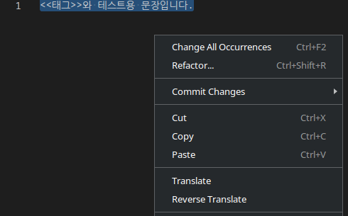

# Fastko
fastko, fast korean translation. Uses [naver papago api](https://developers.naver.com/docs/common/openapiguide/).

## Screenshots

## Features

* Translate selected text
* Configure source and target language
* Recognize special symbol(ex. << and >>), and replace to alpabets(A, B, C...)

## Requirements

You needs naver api id and secret.

## Extension Settings

* `fastko.client.id`: naver api id
* `fastko.client.secret`: naver api secret
* `fastko.lang.source`: source language
* `fastko.lang.target`: target language